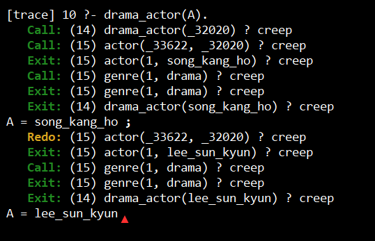

# Processamento de Consultas em Prolog

## Unificação

é o processo de tentar tornar dois termos iguais por substituição<br>
Se não for possível, a unificação falha

Exemplo:

```prolog
animal(X) = animal(gato).
X = gato.
```

## Backtracking

é o mecanismo que o Prolog usa para voltar e tentar outras alternativas quando uma tentativa falha ou quando pedimos mais soluções com ;

## Exemplo dos conceitos

```prolog
animal(aguia).
animal(gato).
animal(cachorro).

peludo(gato).
peludo(cachorro).

animal_ideal(X) :- animal(X), peludo(X).
```

### Consulta
```
?- animal_ideal(X).
```

Resultado:
```
X = gato ;
X = cachorro.
```
---
### Parte prática
```prolog
actor(1, song_kang_ho).
actor(1, lee_sun_kyun).

genre(1, drama).

drama_actor(A) :- actor(M, A), genre(M, drama).
```

### Consulta
```
?- drama_actor(A).
```

### Palavras-chave do trace:
Call -> tentativa de executar um objetivo<br>
Exit -> unificação foi bem sucedida<br>
Redo -> Backtracking<br>




### Fontes
https://www.dai.ed.ac.uk/groups/ssp/bookpages/quickprolog/node11.html<br>
https://www.tutorialspoint.com/prolog/prolog_backtracking.htm

